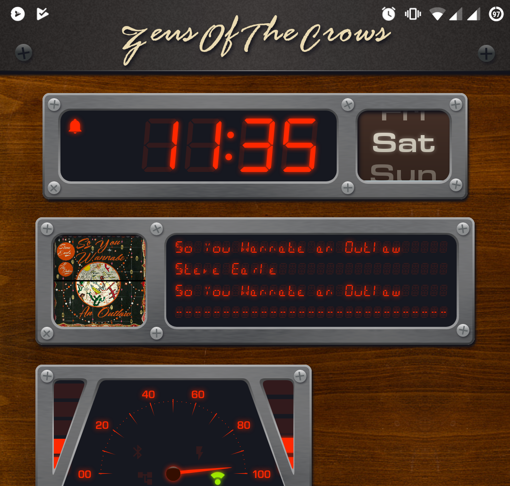

# DSEG Font Family

## Modified version of keshikan's fantastic digital segment display font

[Entire glyph list (warning, large image at end)](./sample/glyphlist.md)

### Changes:

* Added Cyrillic alphabet (uppercase only for now)

* Added Greek alphabet (uppercase only for now)

* Copied Latin letters to accented Latin (no changes {for now?})

* **Moved some punctuation marks to** (in my opinion) **more sensible locations**

  > (this was done as i found myself writing of lot of `str.replace(" ", "!")`)

  * " " - u0020: now the same width as the characters, taking the place of Exclam
  * ; - u003B: now the blank alternative to :, taking the place of Space
  * ! - now lower colon dot, taking the place of Hash/Octothorpe (mirroring ¡, upper colon dot)
  * \# - now fully filled character, taking the place of tilde
  * ~ - now duplicate of hyphen

* Added some auxiliary Latin letters

  * Æ, æ - u00C6, u00E6
  * Œ, œ, - u0152, u0153
  * Ð, ð - u00D0, u00F0
  * Ø, ø - u00D8, u00F8
  * ß - u00DF

* Added/changed various less significant punctuation marks:

  * ¶ (pilcrow)
  * ¢ (cent mark)
  * ₩ (won sign)

* Changed the form of some characters 

  > (keshikan's version available at uFF10 – uFF5E, fullwidth latin block)

  * S - u0053: reverted to older form
  *  " - u0022: changed to vertical (caron form is available at u21E9, downwards white arrow)

  * i - u0069: added tittle
  * j - u006A: changed form, added tittle
  * w - u0077: changed to rounded form

### additionally, changed to semantic versioning system, as i find that easier to deal with

---

### Todo:

* Better glyphs for Æ, æ, œ, Ъ, Й, Ё, Ю, Ω,
* Add glyphs for ð, þ, Þ, ₤, €, 
* Distinction between Е and Ё
* Tally marks? (𝍠, 𝍡, 𝍢) (for now use "_", "=", "Ξ")
* Box drawing characters? (ascii extended)
* Alternative letterforms in fullwidþ block
  * 1, 2, 3, 5, 7, 
  * G, J, M, S, W, Y, Z,
  * i, j, w, 

---

Usage samples:

---

## Original readme proceeds:

## Overview

DSEG is a free font which imitate LCD Display (7SEG, 14SEG, Weather icons etc.).
DSEG have special features:

 - Includes the roman-alphabet and symbol glyphs.
 - Many types(over 50) are available.
 - Licensed under [SIL OPEN FONT LICENSE Version 1.1](http://scripts.sil.org/OFL). You can use DSEG for non-commercial and commercial purposes.

## Sample

## Usage

 - Colon and Space have same width.

   

 - Period has zero width.

   

 - All-off (Exclamation)

   

 - All-on ("8" or Tilda)

   

## Others

For more information, visit DSEG support page.

 - English:[https://www.keshikan.net/fonts-e.html](https://www.keshikan.net/fonts-e.html)
 - Japanese:[https://www.keshikan.net/fonts.html](https://www.keshikan.net/fonts.html)

## How to Install

### Download release binary

[release binary](https://github.com/keshikan/DSEG/releases)

Attention:Beta version may have compatibility issues with previous versions.

### Build from source(*.sfd)

Install [FontForge](https://fontforge.github.io/en-US/) and [Google woff2](https://github.com/google/woff2), and type below.

     $ make

### Install in Ubuntu(18.04 or later)
    $ sudo apt-get install fonts-dseg

### Install from npm
    $ npm i dseg

## Changelog
 - [v0.50beta](https://github.com/keshikan/DSEG/releases)
    - Changed source file structure.
    - Added and Changed some glyphs.
    Thanks to [graphemecluster]

 - [v0.46(2020-03-15)](https://github.com/keshikan/DSEG/releases/download/v0.46/fonts-DSEG_v046.zip)
    - Added "DEGREE SIGN"(U+00B0).
    - Added "LOW LINE"(U+005F) on DSEG7.
    - Fixed an issue where the period(U+002E) width had negative value.

 - [v0.45(2018-01-09)](https://github.com/keshikan/DSEG/releases/download/v0.45/fonts-DSEG_v045.zip)
    - Added makefile and build script. (Merged [#8](https://github.com/keshikan/DSEG/pull/8) [#9](https://github.com/keshikan/DSEG/pull/9) . Thanks to [alexmyczko](https://github.com/alexmyczko))

 - [v0.44(2018-01-02)](https://github.com/keshikan/DSEG/archive/v0.44.zip)
    - Modified colon character position for balancing in Italic style. See below.  
    
    - Added License metadata to *.ttf .
    - Changed file name of *.sfd to match it's font-name.
  
 - [v0.43(2017-08-15)](https://github.com/keshikan/DSEG/archive/v0.43.zip)
    - Added package.json and registerd npmjs.com. ([merged #5](https://github.com/keshikan/DSEG/pull/5). Thanks to [nils-werner](https://github.com/nils-werner))

 - [v0.42(2017-04-27)](https://github.com/keshikan/DSEG/archive/v0.42.zip)
    - Added WOFF2 file format.
    - Added [extended metadata block](https://www.w3.org/TR/WOFF/#Metadata)  to *.woff and *.woff2. 
  
 - [v0.41(2017-01-07)](https://github.com/keshikan/DSEG/archive/v0.41.zip)
    - Assigned all-segment-off status to exclamation mark(U+0021).

 - [v0.40(2017-01-06)](https://github.com/keshikan/DSEG/archive/v0.40.zip)
    - First released in Github.
    - Added weather icons "DSEGWeather".
    - The license has been changed to the [SIL OPEN FONT LICENSE Version 1.1](http://scripts.sil.org/OFL).
    
 - v0.1x-0.30(2014-09-07 to 2017-01-07)
    - Older version(not recommended).
    - The license is original, not OFL1.1. When use this, read the attached document please.
    - [Download v0.30](https://www.keshikan.net/archive/DSEG_v030.zip)

## License

- Any font files(*.ttf, *.woff, *.sfd) are licensed under the [SIL OPEN FONT LICENSE Version 1.1](http://scripts.sil.org/OFL)
