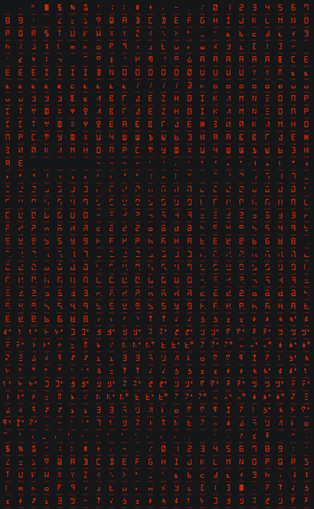

| Position         | 0                                                            | 1                                                            | 2                                                            | 3                                                            | 4                                                            | 5                                                            | 6                                                            | 7                                                            | 8                                                            | 9                                                            | a                                                            | b                                                            | c                                                            | d                                                            | e                                                            | f                                                            |
| :--------------- | :----------------------------------------------------------- | :----------------------------------------------------------- | :----------------------------------------------------------- | :----------------------------------------------------------- | :----------------------------------------------------------- | :----------------------------------------------------------- | :----------------------------------------------------------- | :----------------------------------------------------------- | :----------------------------------------------------------- | :----------------------------------------------------------- | :----------------------------------------------------------- | :----------------------------------------------------------- | :----------------------------------------------------------- | :----------------------------------------------------------- | :----------------------------------------------------------- | :----------------------------------------------------------- |
| U+0000           | No                                                           | No                                                           | No                                                           | No                                                           | No                                                           | No                                                           | No                                                           | No                                                           | No                                                           |                                                              |                                                              | No                                                           | No                                                           |                                                              | No                                                           | No                                                           |
| U+0010 to U+001F | no support                                                   |                                                              |                                                              |                                                              |                                                              |                                                              |                                                              |                                                              |                                                              |                                                              |                                                              |                                                              |                                                              |                                                              |                                                              |                                                              |
| U+0020           |                                                              | [!](https://www.fileformat.info/info/unicode/char/0021/index.htm) | ["](https://www.fileformat.info/info/unicode/char/0022/index.htm) | [#](https://www.fileformat.info/info/unicode/char/0023/index.htm) | [$](https://www.fileformat.info/info/unicode/char/0024/index.htm) | [%](https://www.fileformat.info/info/unicode/char/0025/index.htm) | [&](https://www.fileformat.info/info/unicode/char/0026/index.htm) | ['](https://www.fileformat.info/info/unicode/char/0027/index.htm) | [(](https://www.fileformat.info/info/unicode/char/0028/index.htm) | [)](https://www.fileformat.info/info/unicode/char/0029/index.htm) | [*](https://www.fileformat.info/info/unicode/char/002a/index.htm) | [+](https://www.fileformat.info/info/unicode/char/002b/index.htm) | [,](https://www.fileformat.info/info/unicode/char/002c/index.htm) | [-](https://www.fileformat.info/info/unicode/char/002d/index.htm) | [.](https://www.fileformat.info/info/unicode/char/002e/index.htm) | [/](https://www.fileformat.info/info/unicode/char/002f/index.htm) |
| U+0030           | [0](https://www.fileformat.info/info/unicode/char/0030/index.htm) | [1](https://www.fileformat.info/info/unicode/char/0031/index.htm) | [2](https://www.fileformat.info/info/unicode/char/0032/index.htm) | [3](https://www.fileformat.info/info/unicode/char/0033/index.htm) | [4](https://www.fileformat.info/info/unicode/char/0034/index.htm) | [5](https://www.fileformat.info/info/unicode/char/0035/index.htm) | [6](https://www.fileformat.info/info/unicode/char/0036/index.htm) | [7](https://www.fileformat.info/info/unicode/char/0037/index.htm) | [8](https://www.fileformat.info/info/unicode/char/0038/index.htm) | [9](https://www.fileformat.info/info/unicode/char/0039/index.htm) | [:](https://www.fileformat.info/info/unicode/char/003a/index.htm) | [;](https://www.fileformat.info/info/unicode/char/003b/index.htm) | [<](https://www.fileformat.info/info/unicode/char/003c/index.htm) | [=](https://www.fileformat.info/info/unicode/char/003d/index.htm) | [>](https://www.fileformat.info/info/unicode/char/003e/index.htm) | [?](https://www.fileformat.info/info/unicode/char/003f/index.htm) |
| U+0040           | [@](https://www.fileformat.info/info/unicode/char/0040/index.htm) | [A](https://www.fileformat.info/info/unicode/char/0041/index.htm) | [B](https://www.fileformat.info/info/unicode/char/0042/index.htm) | [C](https://www.fileformat.info/info/unicode/char/0043/index.htm) | [D](https://www.fileformat.info/info/unicode/char/0044/index.htm) | [E](https://www.fileformat.info/info/unicode/char/0045/index.htm) | [F](https://www.fileformat.info/info/unicode/char/0046/index.htm) | [G](https://www.fileformat.info/info/unicode/char/0047/index.htm) | [H](https://www.fileformat.info/info/unicode/char/0048/index.htm) | [I](https://www.fileformat.info/info/unicode/char/0049/index.htm) | [J](https://www.fileformat.info/info/unicode/char/004a/index.htm) | [K](https://www.fileformat.info/info/unicode/char/004b/index.htm) | [L](https://www.fileformat.info/info/unicode/char/004c/index.htm) | [M](https://www.fileformat.info/info/unicode/char/004d/index.htm) | [N](https://www.fileformat.info/info/unicode/char/004e/index.htm) | [O](https://www.fileformat.info/info/unicode/char/004f/index.htm) |
| U+0050           | [P](https://www.fileformat.info/info/unicode/char/0050/index.htm) | [Q](https://www.fileformat.info/info/unicode/char/0051/index.htm) | [R](https://www.fileformat.info/info/unicode/char/0052/index.htm) | [S](https://www.fileformat.info/info/unicode/char/0053/index.htm) | [T](https://www.fileformat.info/info/unicode/char/0054/index.htm) | [U](https://www.fileformat.info/info/unicode/char/0055/index.htm) | [V](https://www.fileformat.info/info/unicode/char/0056/index.htm) | [W](https://www.fileformat.info/info/unicode/char/0057/index.htm) | [X](https://www.fileformat.info/info/unicode/char/0058/index.htm) | [Y](https://www.fileformat.info/info/unicode/char/0059/index.htm) | [Z](https://www.fileformat.info/info/unicode/char/005a/index.htm) | [\ | [\\](https://www.fileformat.info/info/unicode/char/005c/index.htm) | [\]](https://www.fileformat.info/info/unicode/char/005d/index.htm) | [^](https://www.fileformat.info/info/unicode/char/005e/index.htm) | [_](https://www.fileformat.info/info/unicode/char/005f/index.htm) |
| U+0060           | [`](https://www.fileformat.info/info/unicode/char/0060/index.htm) | [a](https://www.fileformat.info/info/unicode/char/0061/index.htm) | [b](https://www.fileformat.info/info/unicode/char/0062/index.htm) | [c](https://www.fileformat.info/info/unicode/char/0063/index.htm) | [d](https://www.fileformat.info/info/unicode/char/0064/index.htm) | [e](https://www.fileformat.info/info/unicode/char/0065/index.htm) | [f](https://www.fileformat.info/info/unicode/char/0066/index.htm) | [g](https://www.fileformat.info/info/unicode/char/0067/index.htm) | [h](https://www.fileformat.info/info/unicode/char/0068/index.htm) | [i](https://www.fileformat.info/info/unicode/char/0069/index.htm) | [j](https://www.fileformat.info/info/unicode/char/006a/index.htm) | [k](https://www.fileformat.info/info/unicode/char/006b/index.htm) | [l](https://www.fileformat.info/info/unicode/char/006c/index.htm) | [m](https://www.fileformat.info/info/unicode/char/006d/index.htm) | [n](https://www.fileformat.info/info/unicode/char/006e/index.htm) | [o](https://www.fileformat.info/info/unicode/char/006f/index.htm) |
| U+0070           | [p](https://www.fileformat.info/info/unicode/char/0070/index.htm) | [q](https://www.fileformat.info/info/unicode/char/0071/index.htm) | [r](https://www.fileformat.info/info/unicode/char/0072/index.htm) | [s](https://www.fileformat.info/info/unicode/char/0073/index.htm) | [t](https://www.fileformat.info/info/unicode/char/0074/index.htm) | [u](https://www.fileformat.info/info/unicode/char/0075/index.htm) | [v](https://www.fileformat.info/info/unicode/char/0076/index.htm) | [w](https://www.fileformat.info/info/unicode/char/0077/index.htm) | [x](https://www.fileformat.info/info/unicode/char/0078/index.htm) | [y](https://www.fileformat.info/info/unicode/char/0079/index.htm) | [z](https://www.fileformat.info/info/unicode/char/007a/index.htm) | [{](https://www.fileformat.info/info/unicode/char/007b/index.htm) | [\|](https://www.fileformat.info/info/unicode/char/007c/index.htm) | [}](https://www.fileformat.info/info/unicode/char/007d/index.htm) | [~](https://www.fileformat.info/info/unicode/char/007e/index.htm) | No                                                           |
| U+0080 to U+009F | no support                                                   |                                                              |                                                              |                                                              |                                                              |                                                              |                                                              |                                                              |                                                              |                                                              |                                                              |                                                              |                                                              |                                                              |                                                              |                                                              |
| U+00A0           |  | [¡](https://www.fileformat.info/info/unicode/char/00a1/index.htm) | [¢](https://www.fileformat.info/info/unicode/char/00a2/index.htm) | No                                                           | No                                                           | [¥](https://www.fileformat.info/info/unicode/char/00a5/index.htm) | [¦](https://www.fileformat.info/info/unicode/char/00a6/index.htm) | No                                                           | No                                                           | No                                                           | No                                                           | No                                                           | [¬](https://www.fileformat.info/info/unicode/char/00ac/index.htm) | [­](https://www.fileformat.info/info/unicode/char/00ad/index.htm) | No                                                           | [¯](https://www.fileformat.info/info/unicode/char/00af/index.htm) |
| U+00B0           | [°](https://www.fileformat.info/info/unicode/char/00b0/index.htm) | [±](https://www.fileformat.info/info/unicode/char/00b1/index.htm) | No                                                           | No                                                           | [´](https://www.fileformat.info/info/unicode/char/00b4/index.htm) | [µ](https://www.fileformat.info/info/unicode/char/00b5/index.htm) | [¶](https://www.fileformat.info/info/unicode/char/00b6/index.htm) | No                                                           | No                                                           | [¹](https://www.fileformat.info/info/unicode/char/00b9/index.htm) | [º](https://www.fileformat.info/info/unicode/char/00ba/index.htm) | No                                                           | No                                                           | No                                                           | No                                                           | [¿](https://www.fileformat.info/info/unicode/char/00bf/index.htm) |
| U+00C0           | [À](https://www.fileformat.info/info/unicode/char/00c0/index.htm) | [Á](https://www.fileformat.info/info/unicode/char/00c1/index.htm) | [Â](https://www.fileformat.info/info/unicode/char/00c2/index.htm) | [Ã](https://www.fileformat.info/info/unicode/char/00c3/index.htm) | [Ä](https://www.fileformat.info/info/unicode/char/00c4/index.htm) | [Å](https://www.fileformat.info/info/unicode/char/00c5/index.htm) | [Æ](https://www.fileformat.info/info/unicode/char/00c6/index.htm) | [Ç](https://www.fileformat.info/info/unicode/char/00c7/index.htm) | [È](https://www.fileformat.info/info/unicode/char/00c8/index.htm) | [É](https://www.fileformat.info/info/unicode/char/00c9/index.htm) | [Ê](https://www.fileformat.info/info/unicode/char/00ca/index.htm) | [Ë](https://www.fileformat.info/info/unicode/char/00cb/index.htm) | [Ì](https://www.fileformat.info/info/unicode/char/00cc/index.htm) | [Í](https://www.fileformat.info/info/unicode/char/00cd/index.htm) | [Î](https://www.fileformat.info/info/unicode/char/00ce/index.htm) | [Ï](https://www.fileformat.info/info/unicode/char/00cf/index.htm) |
| U+00D0           | [Ð](https://www.fileformat.info/info/unicode/char/00d0/index.htm) | [Ñ](https://www.fileformat.info/info/unicode/char/00d1/index.htm) | [Ò](https://www.fileformat.info/info/unicode/char/00d2/index.htm) | [Ó](https://www.fileformat.info/info/unicode/char/00d3/index.htm) | [Ô](https://www.fileformat.info/info/unicode/char/00d4/index.htm) | [Õ](https://www.fileformat.info/info/unicode/char/00d5/index.htm) | [Ö](https://www.fileformat.info/info/unicode/char/00d6/index.htm) | No                                                           | [Ø](https://www.fileformat.info/info/unicode/char/00d8/index.htm) | [Ù](https://www.fileformat.info/info/unicode/char/00d9/index.htm) | [Ú](https://www.fileformat.info/info/unicode/char/00da/index.htm) | [Û](https://www.fileformat.info/info/unicode/char/00db/index.htm) | [Ü](https://www.fileformat.info/info/unicode/char/00dc/index.htm) | [Ý](https://www.fileformat.info/info/unicode/char/00dd/index.htm) | [Þ](https://www.fileformat.info/info/unicode/char/00de/index.htm) | [ß](https://www.fileformat.info/info/unicode/char/00df/index.htm) |
| U+00E0           | [à](https://www.fileformat.info/info/unicode/char/00e0/index.htm) | [á](https://www.fileformat.info/info/unicode/char/00e1/index.htm) | [â](https://www.fileformat.info/info/unicode/char/00e2/index.htm) | [ã](https://www.fileformat.info/info/unicode/char/00e3/index.htm) | [ä](https://www.fileformat.info/info/unicode/char/00e4/index.htm) | [å](https://www.fileformat.info/info/unicode/char/00e5/index.htm) | [æ](https://www.fileformat.info/info/unicode/char/00e6/index.htm) | [ç](https://www.fileformat.info/info/unicode/char/00e7/index.htm) | [è](https://www.fileformat.info/info/unicode/char/00e8/index.htm) | [é](https://www.fileformat.info/info/unicode/char/00e9/index.htm) | [ê](https://www.fileformat.info/info/unicode/char/00ea/index.htm) | [ë](https://www.fileformat.info/info/unicode/char/00eb/index.htm) | [ì](https://www.fileformat.info/info/unicode/char/00ec/index.htm) | [í](https://www.fileformat.info/info/unicode/char/00ed/index.htm) | [î](https://www.fileformat.info/info/unicode/char/00ee/index.htm) | [ï](https://www.fileformat.info/info/unicode/char/00ef/index.htm) |
| U+00F0           | [ð](https://www.fileformat.info/info/unicode/char/00f0/index.htm) | [ñ](https://www.fileformat.info/info/unicode/char/00f1/index.htm) | [ò](https://www.fileformat.info/info/unicode/char/00f2/index.htm) | [ó](https://www.fileformat.info/info/unicode/char/00f3/index.htm) | [ô](https://www.fileformat.info/info/unicode/char/00f4/index.htm) | [õ](https://www.fileformat.info/info/unicode/char/00f5/index.htm) | [ö](https://www.fileformat.info/info/unicode/char/00f6/index.htm) | No                                                           | [ø](https://www.fileformat.info/info/unicode/char/00f8/index.htm) | [ù](https://www.fileformat.info/info/unicode/char/00f9/index.htm) | [ú](https://www.fileformat.info/info/unicode/char/00fa/index.htm) | [û](https://www.fileformat.info/info/unicode/char/00fb/index.htm) | [ü](https://www.fileformat.info/info/unicode/char/00fc/index.htm) | [ý](https://www.fileformat.info/info/unicode/char/00fd/index.htm) | [þ](https://www.fileformat.info/info/unicode/char/00fe/index.htm) | [ÿ](https://www.fileformat.info/info/unicode/char/00ff/index.htm) |
| U+0100 to U+014F | no support                                                   |                                                              |                                                              |                                                              |                                                              |                                                              |                                                              |                                                              |                                                              |                                                              |                                                              |                                                              |                                                              |                                                              |                                                              |                                                              |
| U+0150           | No                                                           | No                                                           | [Œ](https://www.fileformat.info/info/unicode/char/0152/index.htm) | [œ](https://www.fileformat.info/info/unicode/char/0153/index.htm) | No                                                           | No                                                           | No                                                           | No                                                           | No                                                           | No                                                           | No                                                           | No                                                           | No                                                           | No                                                           | No                                                           | No                                                           |
| U+0160 to U+038F | no support                                                   |                                                              |                                                              |                                                              |                                                              |                                                              |                                                              |                                                              |                                                              |                                                              |                                                              |                                                              |                                                              |                                                              |                                                              |                                                              |
| U+0390           | No                                                           | [Α](https://www.fileformat.info/info/unicode/char/0391/index.htm) | [Β](https://www.fileformat.info/info/unicode/char/0392/index.htm) | [Γ](https://www.fileformat.info/info/unicode/char/0393/index.htm) | [Δ](https://www.fileformat.info/info/unicode/char/0394/index.htm) | [Ε](https://www.fileformat.info/info/unicode/char/0395/index.htm) | [Ζ](https://www.fileformat.info/info/unicode/char/0396/index.htm) | [Η](https://www.fileformat.info/info/unicode/char/0397/index.htm) | [Θ](https://www.fileformat.info/info/unicode/char/0398/index.htm) | [Ι](https://www.fileformat.info/info/unicode/char/0399/index.htm) | [Κ](https://www.fileformat.info/info/unicode/char/039a/index.htm) | [Λ](https://www.fileformat.info/info/unicode/char/039b/index.htm) | [Μ](https://www.fileformat.info/info/unicode/char/039c/index.htm) | [Ν](https://www.fileformat.info/info/unicode/char/039d/index.htm) | [Ξ](https://www.fileformat.info/info/unicode/char/039e/index.htm) | [Ο](https://www.fileformat.info/info/unicode/char/039f/index.htm) |
| U+03A0           | [Π](https://www.fileformat.info/info/unicode/char/03a0/index.htm) | [Ρ](https://www.fileformat.info/info/unicode/char/03a1/index.htm) | No                                                           | [Σ](https://www.fileformat.info/info/unicode/char/03a3/index.htm) | [Τ](https://www.fileformat.info/info/unicode/char/03a4/index.htm) | [Υ](https://www.fileformat.info/info/unicode/char/03a5/index.htm) | [Φ](https://www.fileformat.info/info/unicode/char/03a6/index.htm) | [Χ](https://www.fileformat.info/info/unicode/char/03a7/index.htm) | [Ψ](https://www.fileformat.info/info/unicode/char/03a8/index.htm) | [Ω](https://www.fileformat.info/info/unicode/char/03a9/index.htm) | No                                                           | No                                                           | No                                                           | No                                                           | No                                                           | No                                                           |
| U+03B0           | No                                                           | [α](https://www.fileformat.info/info/unicode/char/03b1/index.htm) | [β](https://www.fileformat.info/info/unicode/char/03b2/index.htm) | [γ](https://www.fileformat.info/info/unicode/char/03b3/index.htm) | [δ](https://www.fileformat.info/info/unicode/char/03b4/index.htm) | [ε](https://www.fileformat.info/info/unicode/char/03b5/index.htm) | [ζ](https://www.fileformat.info/info/unicode/char/03b6/index.htm) | [η](https://www.fileformat.info/info/unicode/char/03b7/index.htm) | [θ](https://www.fileformat.info/info/unicode/char/03b8/index.htm) | [ι](https://www.fileformat.info/info/unicode/char/03b9/index.htm) | [κ](https://www.fileformat.info/info/unicode/char/03ba/index.htm) | [λ](https://www.fileformat.info/info/unicode/char/03bb/index.htm) | [μ](https://www.fileformat.info/info/unicode/char/03bc/index.htm) | [ν](https://www.fileformat.info/info/unicode/char/03bd/index.htm) | [ξ](https://www.fileformat.info/info/unicode/char/03be/index.htm) | [ο](https://www.fileformat.info/info/unicode/char/03bf/index.htm) |
| U+03C0           | [π](https://www.fileformat.info/info/unicode/char/03c0/index.htm) | [ρ](https://www.fileformat.info/info/unicode/char/03c1/index.htm) | [ς](https://www.fileformat.info/info/unicode/char/03c2/index.htm) | [σ](https://www.fileformat.info/info/unicode/char/03c3/index.htm) | [τ](https://www.fileformat.info/info/unicode/char/03c4/index.htm) | [υ](https://www.fileformat.info/info/unicode/char/03c5/index.htm) | [φ](https://www.fileformat.info/info/unicode/char/03c6/index.htm) | [χ](https://www.fileformat.info/info/unicode/char/03c7/index.htm) | [ψ](https://www.fileformat.info/info/unicode/char/03c8/index.htm) | [ω](https://www.fileformat.info/info/unicode/char/03c9/index.htm) | No                                                           | No                                                           | No                                                           | No                                                           | No                                                           | No                                                           |
| U+03D0 to U+03FF | no support                                                   |                                                              |                                                              |                                                              |                                                              |                                                              |                                                              |                                                              |                                                              |                                                              |                                                              |                                                              |                                                              |                                                              |                                                              |                                                              |
| U+0400           | No                                                           | [Ё](https://www.fileformat.info/info/unicode/char/0401/index.htm) | No                                                           | No                                                           | No                                                           | No                                                           | No                                                           | No                                                           | No                                                           | No                                                           | No                                                           | No                                                           | No                                                           | No                                                           | No                                                           | No                                                           |
| U+0410           | [А](https://www.fileformat.info/info/unicode/char/0410/index.htm) | [Б](https://www.fileformat.info/info/unicode/char/0411/index.htm) | [В](https://www.fileformat.info/info/unicode/char/0412/index.htm) | [Г](https://www.fileformat.info/info/unicode/char/0413/index.htm) | [Д](https://www.fileformat.info/info/unicode/char/0414/index.htm) | [Е](https://www.fileformat.info/info/unicode/char/0415/index.htm) | [Ж](https://www.fileformat.info/info/unicode/char/0416/index.htm) | [З](https://www.fileformat.info/info/unicode/char/0417/index.htm) | [И](https://www.fileformat.info/info/unicode/char/0418/index.htm) | [Й](https://www.fileformat.info/info/unicode/char/0419/index.htm) | [К](https://www.fileformat.info/info/unicode/char/041a/index.htm) | [Л](https://www.fileformat.info/info/unicode/char/041b/index.htm) | [М](https://www.fileformat.info/info/unicode/char/041c/index.htm) | [Н](https://www.fileformat.info/info/unicode/char/041d/index.htm) | [О](https://www.fileformat.info/info/unicode/char/041e/index.htm) | [П](https://www.fileformat.info/info/unicode/char/041f/index.htm) |
| U+0420           | [Р](https://www.fileformat.info/info/unicode/char/0420/index.htm) | [С](https://www.fileformat.info/info/unicode/char/0421/index.htm) | [Т](https://www.fileformat.info/info/unicode/char/0422/index.htm) | [У](https://www.fileformat.info/info/unicode/char/0423/index.htm) | [Ф](https://www.fileformat.info/info/unicode/char/0424/index.htm) | [Х](https://www.fileformat.info/info/unicode/char/0425/index.htm) | [Ц](https://www.fileformat.info/info/unicode/char/0426/index.htm) | [Ч](https://www.fileformat.info/info/unicode/char/0427/index.htm) | [Ш](https://www.fileformat.info/info/unicode/char/0428/index.htm) | [Щ](https://www.fileformat.info/info/unicode/char/0429/index.htm) | [Ъ](https://www.fileformat.info/info/unicode/char/042a/index.htm) | [Ы](https://www.fileformat.info/info/unicode/char/042b/index.htm) | [Ь](https://www.fileformat.info/info/unicode/char/042c/index.htm) | [Э](https://www.fileformat.info/info/unicode/char/042d/index.htm) | [Ю](https://www.fileformat.info/info/unicode/char/042e/index.htm) | [Я](https://www.fileformat.info/info/unicode/char/042f/index.htm) |
| U+0430           | [а](https://www.fileformat.info/info/unicode/char/0430/index.htm) | [б](https://www.fileformat.info/info/unicode/char/0431/index.htm) | [в](https://www.fileformat.info/info/unicode/char/0432/index.htm) | [г](https://www.fileformat.info/info/unicode/char/0433/index.htm) | [д](https://www.fileformat.info/info/unicode/char/0434/index.htm) | [е](https://www.fileformat.info/info/unicode/char/0435/index.htm) | [ж](https://www.fileformat.info/info/unicode/char/0436/index.htm) | [з](https://www.fileformat.info/info/unicode/char/0437/index.htm) | [и](https://www.fileformat.info/info/unicode/char/0438/index.htm) | [й](https://www.fileformat.info/info/unicode/char/0439/index.htm) | [к](https://www.fileformat.info/info/unicode/char/043a/index.htm) | [л](https://www.fileformat.info/info/unicode/char/043b/index.htm) | [м](https://www.fileformat.info/info/unicode/char/043c/index.htm) | [н](https://www.fileformat.info/info/unicode/char/043d/index.htm) | [о](https://www.fileformat.info/info/unicode/char/043e/index.htm) | [п](https://www.fileformat.info/info/unicode/char/043f/index.htm) |
| U+0440           | [р](https://www.fileformat.info/info/unicode/char/0440/index.htm) | [с](https://www.fileformat.info/info/unicode/char/0441/index.htm) | [т](https://www.fileformat.info/info/unicode/char/0442/index.htm) | [у](https://www.fileformat.info/info/unicode/char/0443/index.htm) | [ф](https://www.fileformat.info/info/unicode/char/0444/index.htm) | [х](https://www.fileformat.info/info/unicode/char/0445/index.htm) | [ц](https://www.fileformat.info/info/unicode/char/0446/index.htm) | [ч](https://www.fileformat.info/info/unicode/char/0447/index.htm) | [ш](https://www.fileformat.info/info/unicode/char/0448/index.htm) | [щ](https://www.fileformat.info/info/unicode/char/0449/index.htm) | [ъ](https://www.fileformat.info/info/unicode/char/044a/index.htm) | [ы](https://www.fileformat.info/info/unicode/char/044b/index.htm) | [ь](https://www.fileformat.info/info/unicode/char/044c/index.htm) | [э](https://www.fileformat.info/info/unicode/char/044d/index.htm) | [ю](https://www.fileformat.info/info/unicode/char/044e/index.htm) | [я](https://www.fileformat.info/info/unicode/char/044f/index.htm) |
| U+0450           | No                                                           | [ё](https://www.fileformat.info/info/unicode/char/0451/index.htm) | No                                                           | No                                                           | No                                                           | No                                                           | No                                                           | No                                                           | No                                                           | No                                                           | No                                                           | No                                                           | No                                                           | No                                                           | No                                                           | No                                                           |
| U+0460 to U+1FFF | no support                                                   |                                                              |                                                              |                                                              |                                                              |                                                              |                                                              |                                                              |                                                              |                                                              |                                                              |                                                              |                                                              |                                                              |                                                              |                                                              |
| U+2000           | No                                                           | No                                                           | No                                                           | No                                                           | No                                                           | No                                                           | No                                                           | [ ](https://www.fileformat.info/info/unicode/char/2007/index.htm) | [ ](https://www.fileformat.info/info/unicode/char/2008/index.htm) | No                                                           | No                                                           |  | [‌](https://www.fileformat.info/info/unicode/char/200c/index.htm) | [‍](https://www.fileformat.info/info/unicode/char/200d/index.htm) | [‎](https://www.fileformat.info/info/unicode/char/200e/index.htm) | [‏](https://www.fileformat.info/info/unicode/char/200f/index.htm) |
| U+2010           | [‐](https://www.fileformat.info/info/unicode/char/2010/index.htm) | [‑](https://www.fileformat.info/info/unicode/char/2011/index.htm) | [‒](https://www.fileformat.info/info/unicode/char/2012/index.htm) | No                                                           | No                                                           | [―](https://www.fileformat.info/info/unicode/char/2015/index.htm) | No                                                           | No                                                           | [‘](https://www.fileformat.info/info/unicode/char/2018/index.htm) | [’](https://www.fileformat.info/info/unicode/char/2019/index.htm) | [‚](https://www.fileformat.info/info/unicode/char/201a/index.htm) | [‛](https://www.fileformat.info/info/unicode/char/201b/index.htm) | [“](https://www.fileformat.info/info/unicode/char/201c/index.htm) | [”](https://www.fileformat.info/info/unicode/char/201d/index.htm) | [„](https://www.fileformat.info/info/unicode/char/201e/index.htm) | [‟](https://www.fileformat.info/info/unicode/char/201f/index.htm) |
| U+2020           | No                                                           | No                                                           | No                                                           | No                                                           | No                                                           | No                                                           | No                                                           | No                                                           | [
](https://www.fileformat.info/info/unicode/char/2028/index.htm) | [
](https://www.fileformat.info/info/unicode/char/2029/index.htm) | [‪](https://www.fileformat.info/info/unicode/char/202a/index.htm) | [‫](https://www.fileformat.info/info/unicode/char/202b/index.htm) | [‬](https://www.fileformat.info/info/unicode/char/202c/index.htm) | [‭](https://www.fileformat.info/info/unicode/char/202d/index.htm) | [‮](https://www.fileformat.info/info/unicode/char/202e/index.htm) | No                                                           |
| U+2030 to U+205F | no support                                                   |                                                              |                                                              |                                                              |                                                              |                                                              |                                                              |                                                              |                                                              |                                                              |                                                              |                                                              |                                                              |                                                              |                                                              |                                                              |
| U+2060           | No                                                           | No                                                           | No                                                           | No                                                           | No                                                           | No                                                           | No                                                           | No                                                           | No                                                           | No                                                           | [](https://www.fileformat.info/info/unicode/char/206a/index.htm) | [](https://www.fileformat.info/info/unicode/char/206b/index.htm) | [](https://www.fileformat.info/info/unicode/char/206c/index.htm) | [](https://www.fileformat.info/info/unicode/char/206d/index.htm) | [](https://www.fileformat.info/info/unicode/char/206e/index.htm) | [](https://www.fileformat.info/info/unicode/char/206f/index.htm) |
| U+2070 to U+218F | no support                                                   |                                                              |                                                              |                                                              |                                                              |                                                              |                                                              |                                                              |                                                              |                                                              |                                                              |                                                              |                                                              |                                                              |                                                              |                                                              |
| U+2190           | [←](https://www.fileformat.info/info/unicode/char/2190/index.htm) | [↑](https://www.fileformat.info/info/unicode/char/2191/index.htm) | [→](https://www.fileformat.info/info/unicode/char/2192/index.htm) | [↓](https://www.fileformat.info/info/unicode/char/2193/index.htm) | No                                                           | No                                                           | [↖](https://www.fileformat.info/info/unicode/char/2196/index.htm) | [↗](https://www.fileformat.info/info/unicode/char/2197/index.htm) | [↘](https://www.fileformat.info/info/unicode/char/2198/index.htm) | [↙](https://www.fileformat.info/info/unicode/char/2199/index.htm) | No                                                           | No                                                           | No                                                           | No                                                           | No                                                           | No                                                           |
| U+21A0 to U+21AF | no support                                                   |                                                              |                                                              |                                                              |                                                              |                                                              |                                                              |                                                              |                                                              |                                                              |                                                              |                                                              |                                                              |                                                              |                                                              |                                                              |
| U+21B0           | No                                                           | No                                                           | No                                                           | No                                                           | No                                                           | No                                                           | No                                                           | No                                                           | No                                                           | No                                                           | No                                                           | No                                                           | [↼](https://www.fileformat.info/info/unicode/char/21bc/index.htm) | [↽](https://www.fileformat.info/info/unicode/char/21bd/index.htm) | [↾](https://www.fileformat.info/info/unicode/char/21be/index.htm) | [↿](https://www.fileformat.info/info/unicode/char/21bf/index.htm) |
| U+21C0           | [⇀](https://www.fileformat.info/info/unicode/char/21c0/index.htm) | [⇁](https://www.fileformat.info/info/unicode/char/21c1/index.htm) | [⇂](https://www.fileformat.info/info/unicode/char/21c2/index.htm) | [⇃](https://www.fileformat.info/info/unicode/char/21c3/index.htm) | No                                                           | No                                                           | No                                                           | No                                                           | No                                                           | No                                                           | No                                                           | No                                                           | No                                                           | No                                                           | No                                                           | No                                                           |
| U+21D0 to U+21DF | no support                                                   |                                                              |                                                              |                                                              |                                                              |                                                              |                                                              |                                                              |                                                              |                                                              |                                                              |                                                              |                                                              |                                                              |                                                              |                                                              |
| U+21E0           | No                                                           | No                                                           | No                                                           | No                                                           | No                                                           | No                                                           | [⇦](https://www.fileformat.info/info/unicode/char/21e6/index.htm) | [⇧](https://www.fileformat.info/info/unicode/char/21e7/index.htm) | [⇨](https://www.fileformat.info/info/unicode/char/21e8/index.htm) | [⇩](https://www.fileformat.info/info/unicode/char/21e9/index.htm) | No                                                           | No                                                           | No                                                           | No                                                           | No                                                           | No                                                           |
| U+21F0 to U+27FF | no support                                                   |                                                              |                                                              |                                                              |                                                              |                                                              |                                                              |                                                              |                                                              |                                                              |                                                              |                                                              |                                                              |                                                              |                                                              |                                                              |
| U+2800           | [⠀](https://www.fileformat.info/info/unicode/char/2800/index.htm) | [⠁](https://www.fileformat.info/info/unicode/char/2801/index.htm) | [⠂](https://www.fileformat.info/info/unicode/char/2802/index.htm) | [⠃](https://www.fileformat.info/info/unicode/char/2803/index.htm) | [⠄](https://www.fileformat.info/info/unicode/char/2804/index.htm) | [⠅](https://www.fileformat.info/info/unicode/char/2805/index.htm) | [⠆](https://www.fileformat.info/info/unicode/char/2806/index.htm) | [⠇](https://www.fileformat.info/info/unicode/char/2807/index.htm) | [⠈](https://www.fileformat.info/info/unicode/char/2808/index.htm) | [⠉](https://www.fileformat.info/info/unicode/char/2809/index.htm) | [⠊](https://www.fileformat.info/info/unicode/char/280a/index.htm) | [⠋](https://www.fileformat.info/info/unicode/char/280b/index.htm) | [⠌](https://www.fileformat.info/info/unicode/char/280c/index.htm) | [⠍](https://www.fileformat.info/info/unicode/char/280d/index.htm) | [⠎](https://www.fileformat.info/info/unicode/char/280e/index.htm) | [⠏](https://www.fileformat.info/info/unicode/char/280f/index.htm) |
| U+2810           | [⠐](https://www.fileformat.info/info/unicode/char/2810/index.htm) | [⠑](https://www.fileformat.info/info/unicode/char/2811/index.htm) | [⠒](https://www.fileformat.info/info/unicode/char/2812/index.htm) | [⠓](https://www.fileformat.info/info/unicode/char/2813/index.htm) | [⠔](https://www.fileformat.info/info/unicode/char/2814/index.htm) | [⠕](https://www.fileformat.info/info/unicode/char/2815/index.htm) | [⠖](https://www.fileformat.info/info/unicode/char/2816/index.htm) | [⠗](https://www.fileformat.info/info/unicode/char/2817/index.htm) | [⠘](https://www.fileformat.info/info/unicode/char/2818/index.htm) | [⠙](https://www.fileformat.info/info/unicode/char/2819/index.htm) | [⠚](https://www.fileformat.info/info/unicode/char/281a/index.htm) | [⠛](https://www.fileformat.info/info/unicode/char/281b/index.htm) | [⠜](https://www.fileformat.info/info/unicode/char/281c/index.htm) | [⠝](https://www.fileformat.info/info/unicode/char/281d/index.htm) | [⠞](https://www.fileformat.info/info/unicode/char/281e/index.htm) | [⠟](https://www.fileformat.info/info/unicode/char/281f/index.htm) |
| U+2820           | [⠠](https://www.fileformat.info/info/unicode/char/2820/index.htm) | [⠡](https://www.fileformat.info/info/unicode/char/2821/index.htm) | [⠢](https://www.fileformat.info/info/unicode/char/2822/index.htm) | [⠣](https://www.fileformat.info/info/unicode/char/2823/index.htm) | [⠤](https://www.fileformat.info/info/unicode/char/2824/index.htm) | [⠥](https://www.fileformat.info/info/unicode/char/2825/index.htm) | [⠦](https://www.fileformat.info/info/unicode/char/2826/index.htm) | [⠧](https://www.fileformat.info/info/unicode/char/2827/index.htm) | [⠨](https://www.fileformat.info/info/unicode/char/2828/index.htm) | [⠩](https://www.fileformat.info/info/unicode/char/2829/index.htm) | [⠪](https://www.fileformat.info/info/unicode/char/282a/index.htm) | [⠫](https://www.fileformat.info/info/unicode/char/282b/index.htm) | [⠬](https://www.fileformat.info/info/unicode/char/282c/index.htm) | [⠭](https://www.fileformat.info/info/unicode/char/282d/index.htm) | [⠮](https://www.fileformat.info/info/unicode/char/282e/index.htm) | [⠯](https://www.fileformat.info/info/unicode/char/282f/index.htm) |
| U+2830           | [⠰](https://www.fileformat.info/info/unicode/char/2830/index.htm) | [⠱](https://www.fileformat.info/info/unicode/char/2831/index.htm) | [⠲](https://www.fileformat.info/info/unicode/char/2832/index.htm) | [⠳](https://www.fileformat.info/info/unicode/char/2833/index.htm) | [⠴](https://www.fileformat.info/info/unicode/char/2834/index.htm) | [⠵](https://www.fileformat.info/info/unicode/char/2835/index.htm) | [⠶](https://www.fileformat.info/info/unicode/char/2836/index.htm) | [⠷](https://www.fileformat.info/info/unicode/char/2837/index.htm) | [⠸](https://www.fileformat.info/info/unicode/char/2838/index.htm) | [⠹](https://www.fileformat.info/info/unicode/char/2839/index.htm) | [⠺](https://www.fileformat.info/info/unicode/char/283a/index.htm) | [⠻](https://www.fileformat.info/info/unicode/char/283b/index.htm) | [⠼](https://www.fileformat.info/info/unicode/char/283c/index.htm) | [⠽](https://www.fileformat.info/info/unicode/char/283d/index.htm) | [⠾](https://www.fileformat.info/info/unicode/char/283e/index.htm) | [⠿](https://www.fileformat.info/info/unicode/char/283f/index.htm) |
| U+2840           | [⡀](https://www.fileformat.info/info/unicode/char/2840/index.htm) | [⡁](https://www.fileformat.info/info/unicode/char/2841/index.htm) | [⡂](https://www.fileformat.info/info/unicode/char/2842/index.htm) | [⡃](https://www.fileformat.info/info/unicode/char/2843/index.htm) | [⡄](https://www.fileformat.info/info/unicode/char/2844/index.htm) | [⡅](https://www.fileformat.info/info/unicode/char/2845/index.htm) | [⡆](https://www.fileformat.info/info/unicode/char/2846/index.htm) | [⡇](https://www.fileformat.info/info/unicode/char/2847/index.htm) | [⡈](https://www.fileformat.info/info/unicode/char/2848/index.htm) | [⡉](https://www.fileformat.info/info/unicode/char/2849/index.htm) | [⡊](https://www.fileformat.info/info/unicode/char/284a/index.htm) | [⡋](https://www.fileformat.info/info/unicode/char/284b/index.htm) | [⡌](https://www.fileformat.info/info/unicode/char/284c/index.htm) | [⡍](https://www.fileformat.info/info/unicode/char/284d/index.htm) | [⡎](https://www.fileformat.info/info/unicode/char/284e/index.htm) | [⡏](https://www.fileformat.info/info/unicode/char/284f/index.htm) |
| U+2850           | [⡐](https://www.fileformat.info/info/unicode/char/2850/index.htm) | [⡑](https://www.fileformat.info/info/unicode/char/2851/index.htm) | [⡒](https://www.fileformat.info/info/unicode/char/2852/index.htm) | [⡓](https://www.fileformat.info/info/unicode/char/2853/index.htm) | [⡔](https://www.fileformat.info/info/unicode/char/2854/index.htm) | [⡕](https://www.fileformat.info/info/unicode/char/2855/index.htm) | [⡖](https://www.fileformat.info/info/unicode/char/2856/index.htm) | [⡗](https://www.fileformat.info/info/unicode/char/2857/index.htm) | [⡘](https://www.fileformat.info/info/unicode/char/2858/index.htm) | [⡙](https://www.fileformat.info/info/unicode/char/2859/index.htm) | [⡚](https://www.fileformat.info/info/unicode/char/285a/index.htm) | [⡛](https://www.fileformat.info/info/unicode/char/285b/index.htm) | [⡜](https://www.fileformat.info/info/unicode/char/285c/index.htm) | [⡝](https://www.fileformat.info/info/unicode/char/285d/index.htm) | [⡞](https://www.fileformat.info/info/unicode/char/285e/index.htm) | [⡟](https://www.fileformat.info/info/unicode/char/285f/index.htm) |
| U+2860           | [⡠](https://www.fileformat.info/info/unicode/char/2860/index.htm) | [⡡](https://www.fileformat.info/info/unicode/char/2861/index.htm) | [⡢](https://www.fileformat.info/info/unicode/char/2862/index.htm) | [⡣](https://www.fileformat.info/info/unicode/char/2863/index.htm) | [⡤](https://www.fileformat.info/info/unicode/char/2864/index.htm) | [⡥](https://www.fileformat.info/info/unicode/char/2865/index.htm) | [⡦](https://www.fileformat.info/info/unicode/char/2866/index.htm) | [⡧](https://www.fileformat.info/info/unicode/char/2867/index.htm) | [⡨](https://www.fileformat.info/info/unicode/char/2868/index.htm) | [⡩](https://www.fileformat.info/info/unicode/char/2869/index.htm) | [⡪](https://www.fileformat.info/info/unicode/char/286a/index.htm) | [⡫](https://www.fileformat.info/info/unicode/char/286b/index.htm) | [⡬](https://www.fileformat.info/info/unicode/char/286c/index.htm) | [⡭](https://www.fileformat.info/info/unicode/char/286d/index.htm) | [⡮](https://www.fileformat.info/info/unicode/char/286e/index.htm) | [⡯](https://www.fileformat.info/info/unicode/char/286f/index.htm) |
| U+2870           | [⡰](https://www.fileformat.info/info/unicode/char/2870/index.htm) | [⡱](https://www.fileformat.info/info/unicode/char/2871/index.htm) | [⡲](https://www.fileformat.info/info/unicode/char/2872/index.htm) | [⡳](https://www.fileformat.info/info/unicode/char/2873/index.htm) | [⡴](https://www.fileformat.info/info/unicode/char/2874/index.htm) | [⡵](https://www.fileformat.info/info/unicode/char/2875/index.htm) | [⡶](https://www.fileformat.info/info/unicode/char/2876/index.htm) | [⡷](https://www.fileformat.info/info/unicode/char/2877/index.htm) | [⡸](https://www.fileformat.info/info/unicode/char/2878/index.htm) | [⡹](https://www.fileformat.info/info/unicode/char/2879/index.htm) | [⡺](https://www.fileformat.info/info/unicode/char/287a/index.htm) | [⡻](https://www.fileformat.info/info/unicode/char/287b/index.htm) | [⡼](https://www.fileformat.info/info/unicode/char/287c/index.htm) | [⡽](https://www.fileformat.info/info/unicode/char/287d/index.htm) | [⡾](https://www.fileformat.info/info/unicode/char/287e/index.htm) | [⡿](https://www.fileformat.info/info/unicode/char/287f/index.htm) |
| U+2880           | [⢀](https://www.fileformat.info/info/unicode/char/2880/index.htm) | [⢁](https://www.fileformat.info/info/unicode/char/2881/index.htm) | [⢂](https://www.fileformat.info/info/unicode/char/2882/index.htm) | [⢃](https://www.fileformat.info/info/unicode/char/2883/index.htm) | [⢄](https://www.fileformat.info/info/unicode/char/2884/index.htm) | [⢅](https://www.fileformat.info/info/unicode/char/2885/index.htm) | [⢆](https://www.fileformat.info/info/unicode/char/2886/index.htm) | [⢇](https://www.fileformat.info/info/unicode/char/2887/index.htm) | [⢈](https://www.fileformat.info/info/unicode/char/2888/index.htm) | [⢉](https://www.fileformat.info/info/unicode/char/2889/index.htm) | [⢊](https://www.fileformat.info/info/unicode/char/288a/index.htm) | [⢋](https://www.fileformat.info/info/unicode/char/288b/index.htm) | [⢌](https://www.fileformat.info/info/unicode/char/288c/index.htm) | [⢍](https://www.fileformat.info/info/unicode/char/288d/index.htm) | [⢎](https://www.fileformat.info/info/unicode/char/288e/index.htm) | [⢏](https://www.fileformat.info/info/unicode/char/288f/index.htm) |
| U+2890           | [⢐](https://www.fileformat.info/info/unicode/char/2890/index.htm) | [⢑](https://www.fileformat.info/info/unicode/char/2891/index.htm) | [⢒](https://www.fileformat.info/info/unicode/char/2892/index.htm) | [⢓](https://www.fileformat.info/info/unicode/char/2893/index.htm) | [⢔](https://www.fileformat.info/info/unicode/char/2894/index.htm) | [⢕](https://www.fileformat.info/info/unicode/char/2895/index.htm) | [⢖](https://www.fileformat.info/info/unicode/char/2896/index.htm) | [⢗](https://www.fileformat.info/info/unicode/char/2897/index.htm) | [⢘](https://www.fileformat.info/info/unicode/char/2898/index.htm) | [⢙](https://www.fileformat.info/info/unicode/char/2899/index.htm) | [⢚](https://www.fileformat.info/info/unicode/char/289a/index.htm) | [⢛](https://www.fileformat.info/info/unicode/char/289b/index.htm) | [⢜](https://www.fileformat.info/info/unicode/char/289c/index.htm) | [⢝](https://www.fileformat.info/info/unicode/char/289d/index.htm) | [⢞](https://www.fileformat.info/info/unicode/char/289e/index.htm) | [⢟](https://www.fileformat.info/info/unicode/char/289f/index.htm) |
| U+28A0           | [⢠](https://www.fileformat.info/info/unicode/char/28a0/index.htm) | [⢡](https://www.fileformat.info/info/unicode/char/28a1/index.htm) | [⢢](https://www.fileformat.info/info/unicode/char/28a2/index.htm) | [⢣](https://www.fileformat.info/info/unicode/char/28a3/index.htm) | [⢤](https://www.fileformat.info/info/unicode/char/28a4/index.htm) | [⢥](https://www.fileformat.info/info/unicode/char/28a5/index.htm) | [⢦](https://www.fileformat.info/info/unicode/char/28a6/index.htm) | [⢧](https://www.fileformat.info/info/unicode/char/28a7/index.htm) | [⢨](https://www.fileformat.info/info/unicode/char/28a8/index.htm) | [⢩](https://www.fileformat.info/info/unicode/char/28a9/index.htm) | [⢪](https://www.fileformat.info/info/unicode/char/28aa/index.htm) | [⢫](https://www.fileformat.info/info/unicode/char/28ab/index.htm) | [⢬](https://www.fileformat.info/info/unicode/char/28ac/index.htm) | [⢭](https://www.fileformat.info/info/unicode/char/28ad/index.htm) | [⢮](https://www.fileformat.info/info/unicode/char/28ae/index.htm) | [⢯](https://www.fileformat.info/info/unicode/char/28af/index.htm) |
| U+28B0           | [⢰](https://www.fileformat.info/info/unicode/char/28b0/index.htm) | [⢱](https://www.fileformat.info/info/unicode/char/28b1/index.htm) | [⢲](https://www.fileformat.info/info/unicode/char/28b2/index.htm) | [⢳](https://www.fileformat.info/info/unicode/char/28b3/index.htm) | [⢴](https://www.fileformat.info/info/unicode/char/28b4/index.htm) | [⢵](https://www.fileformat.info/info/unicode/char/28b5/index.htm) | [⢶](https://www.fileformat.info/info/unicode/char/28b6/index.htm) | [⢷](https://www.fileformat.info/info/unicode/char/28b7/index.htm) | [⢸](https://www.fileformat.info/info/unicode/char/28b8/index.htm) | [⢹](https://www.fileformat.info/info/unicode/char/28b9/index.htm) | [⢺](https://www.fileformat.info/info/unicode/char/28ba/index.htm) | [⢻](https://www.fileformat.info/info/unicode/char/28bb/index.htm) | [⢼](https://www.fileformat.info/info/unicode/char/28bc/index.htm) | [⢽](https://www.fileformat.info/info/unicode/char/28bd/index.htm) | [⢾](https://www.fileformat.info/info/unicode/char/28be/index.htm) | [⢿](https://www.fileformat.info/info/unicode/char/28bf/index.htm) |
| U+28C0           | [⣀](https://www.fileformat.info/info/unicode/char/28c0/index.htm) | [⣁](https://www.fileformat.info/info/unicode/char/28c1/index.htm) | [⣂](https://www.fileformat.info/info/unicode/char/28c2/index.htm) | [⣃](https://www.fileformat.info/info/unicode/char/28c3/index.htm) | [⣄](https://www.fileformat.info/info/unicode/char/28c4/index.htm) | [⣅](https://www.fileformat.info/info/unicode/char/28c5/index.htm) | [⣆](https://www.fileformat.info/info/unicode/char/28c6/index.htm) | [⣇](https://www.fileformat.info/info/unicode/char/28c7/index.htm) | [⣈](https://www.fileformat.info/info/unicode/char/28c8/index.htm) | [⣉](https://www.fileformat.info/info/unicode/char/28c9/index.htm) | [⣊](https://www.fileformat.info/info/unicode/char/28ca/index.htm) | [⣋](https://www.fileformat.info/info/unicode/char/28cb/index.htm) | [⣌](https://www.fileformat.info/info/unicode/char/28cc/index.htm) | [⣍](https://www.fileformat.info/info/unicode/char/28cd/index.htm) | [⣎](https://www.fileformat.info/info/unicode/char/28ce/index.htm) | [⣏](https://www.fileformat.info/info/unicode/char/28cf/index.htm) |
| U+28D0           | [⣐](https://www.fileformat.info/info/unicode/char/28d0/index.htm) | [⣑](https://www.fileformat.info/info/unicode/char/28d1/index.htm) | [⣒](https://www.fileformat.info/info/unicode/char/28d2/index.htm) | [⣓](https://www.fileformat.info/info/unicode/char/28d3/index.htm) | [⣔](https://www.fileformat.info/info/unicode/char/28d4/index.htm) | [⣕](https://www.fileformat.info/info/unicode/char/28d5/index.htm) | [⣖](https://www.fileformat.info/info/unicode/char/28d6/index.htm) | [⣗](https://www.fileformat.info/info/unicode/char/28d7/index.htm) | [⣘](https://www.fileformat.info/info/unicode/char/28d8/index.htm) | [⣙](https://www.fileformat.info/info/unicode/char/28d9/index.htm) | [⣚](https://www.fileformat.info/info/unicode/char/28da/index.htm) | [⣛](https://www.fileformat.info/info/unicode/char/28db/index.htm) | [⣜](https://www.fileformat.info/info/unicode/char/28dc/index.htm) | [⣝](https://www.fileformat.info/info/unicode/char/28dd/index.htm) | [⣞](https://www.fileformat.info/info/unicode/char/28de/index.htm) | [⣟](https://www.fileformat.info/info/unicode/char/28df/index.htm) |
| U+28E0           | [⣠](https://www.fileformat.info/info/unicode/char/28e0/index.htm) | [⣡](https://www.fileformat.info/info/unicode/char/28e1/index.htm) | [⣢](https://www.fileformat.info/info/unicode/char/28e2/index.htm) | [⣣](https://www.fileformat.info/info/unicode/char/28e3/index.htm) | [⣤](https://www.fileformat.info/info/unicode/char/28e4/index.htm) | [⣥](https://www.fileformat.info/info/unicode/char/28e5/index.htm) | [⣦](https://www.fileformat.info/info/unicode/char/28e6/index.htm) | [⣧](https://www.fileformat.info/info/unicode/char/28e7/index.htm) | [⣨](https://www.fileformat.info/info/unicode/char/28e8/index.htm) | [⣩](https://www.fileformat.info/info/unicode/char/28e9/index.htm) | [⣪](https://www.fileformat.info/info/unicode/char/28ea/index.htm) | [⣫](https://www.fileformat.info/info/unicode/char/28eb/index.htm) | [⣬](https://www.fileformat.info/info/unicode/char/28ec/index.htm) | [⣭](https://www.fileformat.info/info/unicode/char/28ed/index.htm) | [⣮](https://www.fileformat.info/info/unicode/char/28ee/index.htm) | [⣯](https://www.fileformat.info/info/unicode/char/28ef/index.htm) |
| U+28F0           | [⣰](https://www.fileformat.info/info/unicode/char/28f0/index.htm) | [⣱](https://www.fileformat.info/info/unicode/char/28f1/index.htm) | [⣲](https://www.fileformat.info/info/unicode/char/28f2/index.htm) | [⣳](https://www.fileformat.info/info/unicode/char/28f3/index.htm) | [⣴](https://www.fileformat.info/info/unicode/char/28f4/index.htm) | [⣵](https://www.fileformat.info/info/unicode/char/28f5/index.htm) | [⣶](https://www.fileformat.info/info/unicode/char/28f6/index.htm) | [⣷](https://www.fileformat.info/info/unicode/char/28f7/index.htm) | [⣸](https://www.fileformat.info/info/unicode/char/28f8/index.htm) | [⣹](https://www.fileformat.info/info/unicode/char/28f9/index.htm) | [⣺](https://www.fileformat.info/info/unicode/char/28fa/index.htm) | [⣻](https://www.fileformat.info/info/unicode/char/28fb/index.htm) | [⣼](https://www.fileformat.info/info/unicode/char/28fc/index.htm) | [⣽](https://www.fileformat.info/info/unicode/char/28fd/index.htm) | [⣾](https://www.fileformat.info/info/unicode/char/28fe/index.htm) | [⣿](https://www.fileformat.info/info/unicode/char/28ff/index.htm) |
| U+2900 to U+2AFF | no support                                                   |                                                              |                                                              |                                                              |                                                              |                                                              |                                                              |                                                              |                                                              |                                                              |                                                              |                                                              |                                                              |                                                              |                                                              |                                                              |
| U+2B00           | [⬀](https://www.fileformat.info/info/unicode/char/2b00/index.htm) | [⬁](https://www.fileformat.info/info/unicode/char/2b01/index.htm) | [⬂](https://www.fileformat.info/info/unicode/char/2b02/index.htm) | [⬃](https://www.fileformat.info/info/unicode/char/2b03/index.htm) | No                                                           | No                                                           | No                                                           | No                                                           | No                                                           | No                                                           | No                                                           | No                                                           | No                                                           | No                                                           | No                                                           | No                                                           |
| U+2B10 to U+303F | no support                                                   |                                                              |                                                              |                                                              |                                                              |                                                              |                                                              |                                                              |                                                              |                                                              |                                                              |                                                              |                                                              |                                                              |                                                              |                                                              |
| U+3040           | No                                                           | [ぁ](https://www.fileformat.info/info/unicode/char/3041/index.htm) | [あ](https://www.fileformat.info/info/unicode/char/3042/index.htm) | [ぃ](https://www.fileformat.info/info/unicode/char/3043/index.htm) | [い](https://www.fileformat.info/info/unicode/char/3044/index.htm) | [ぅ](https://www.fileformat.info/info/unicode/char/3045/index.htm) | [う](https://www.fileformat.info/info/unicode/char/3046/index.htm) | [ぇ](https://www.fileformat.info/info/unicode/char/3047/index.htm) | [え](https://www.fileformat.info/info/unicode/char/3048/index.htm) | [ぉ](https://www.fileformat.info/info/unicode/char/3049/index.htm) | [お](https://www.fileformat.info/info/unicode/char/304a/index.htm) | [か](https://www.fileformat.info/info/unicode/char/304b/index.htm) | [が](https://www.fileformat.info/info/unicode/char/304c/index.htm) | [き](https://www.fileformat.info/info/unicode/char/304d/index.htm) | [ぎ](https://www.fileformat.info/info/unicode/char/304e/index.htm) | [く](https://www.fileformat.info/info/unicode/char/304f/index.htm) |
| U+3050           | [ぐ](https://www.fileformat.info/info/unicode/char/3050/index.htm) | [け](https://www.fileformat.info/info/unicode/char/3051/index.htm) | [げ](https://www.fileformat.info/info/unicode/char/3052/index.htm) | [こ](https://www.fileformat.info/info/unicode/char/3053/index.htm) | [ご](https://www.fileformat.info/info/unicode/char/3054/index.htm) | [さ](https://www.fileformat.info/info/unicode/char/3055/index.htm) | [ざ](https://www.fileformat.info/info/unicode/char/3056/index.htm) | [し](https://www.fileformat.info/info/unicode/char/3057/index.htm) | [じ](https://www.fileformat.info/info/unicode/char/3058/index.htm) | [す](https://www.fileformat.info/info/unicode/char/3059/index.htm) | [ず](https://www.fileformat.info/info/unicode/char/305a/index.htm) | [せ](https://www.fileformat.info/info/unicode/char/305b/index.htm) | [ぜ](https://www.fileformat.info/info/unicode/char/305c/index.htm) | [そ](https://www.fileformat.info/info/unicode/char/305d/index.htm) | [ぞ](https://www.fileformat.info/info/unicode/char/305e/index.htm) | [た](https://www.fileformat.info/info/unicode/char/305f/index.htm) |
| U+3060           | [だ](https://www.fileformat.info/info/unicode/char/3060/index.htm) | [ち](https://www.fileformat.info/info/unicode/char/3061/index.htm) | [ぢ](https://www.fileformat.info/info/unicode/char/3062/index.htm) | [っ](https://www.fileformat.info/info/unicode/char/3063/index.htm) | [つ](https://www.fileformat.info/info/unicode/char/3064/index.htm) | [づ](https://www.fileformat.info/info/unicode/char/3065/index.htm) | [て](https://www.fileformat.info/info/unicode/char/3066/index.htm) | [で](https://www.fileformat.info/info/unicode/char/3067/index.htm) | [と](https://www.fileformat.info/info/unicode/char/3068/index.htm) | [ど](https://www.fileformat.info/info/unicode/char/3069/index.htm) | [な](https://www.fileformat.info/info/unicode/char/306a/index.htm) | [に](https://www.fileformat.info/info/unicode/char/306b/index.htm) | [ぬ](https://www.fileformat.info/info/unicode/char/306c/index.htm) | [ね](https://www.fileformat.info/info/unicode/char/306d/index.htm) | [の](https://www.fileformat.info/info/unicode/char/306e/index.htm) | [は](https://www.fileformat.info/info/unicode/char/306f/index.htm) |
| U+3070           | [ば](https://www.fileformat.info/info/unicode/char/3070/index.htm) | [ぱ](https://www.fileformat.info/info/unicode/char/3071/index.htm) | [ひ](https://www.fileformat.info/info/unicode/char/3072/index.htm) | [び](https://www.fileformat.info/info/unicode/char/3073/index.htm) | [ぴ](https://www.fileformat.info/info/unicode/char/3074/index.htm) | [ふ](https://www.fileformat.info/info/unicode/char/3075/index.htm) | [ぶ](https://www.fileformat.info/info/unicode/char/3076/index.htm) | [ぷ](https://www.fileformat.info/info/unicode/char/3077/index.htm) | [へ](https://www.fileformat.info/info/unicode/char/3078/index.htm) | [べ](https://www.fileformat.info/info/unicode/char/3079/index.htm) | [ぺ](https://www.fileformat.info/info/unicode/char/307a/index.htm) | [ほ](https://www.fileformat.info/info/unicode/char/307b/index.htm) | [ぼ](https://www.fileformat.info/info/unicode/char/307c/index.htm) | [ぽ](https://www.fileformat.info/info/unicode/char/307d/index.htm) | [ま](https://www.fileformat.info/info/unicode/char/307e/index.htm) | [み](https://www.fileformat.info/info/unicode/char/307f/index.htm) |
| U+3080           | [む](https://www.fileformat.info/info/unicode/char/3080/index.htm) | [め](https://www.fileformat.info/info/unicode/char/3081/index.htm) | [も](https://www.fileformat.info/info/unicode/char/3082/index.htm) | [ゃ](https://www.fileformat.info/info/unicode/char/3083/index.htm) | [や](https://www.fileformat.info/info/unicode/char/3084/index.htm) | [ゅ](https://www.fileformat.info/info/unicode/char/3085/index.htm) | [ゆ](https://www.fileformat.info/info/unicode/char/3086/index.htm) | [ょ](https://www.fileformat.info/info/unicode/char/3087/index.htm) | [よ](https://www.fileformat.info/info/unicode/char/3088/index.htm) | [ら](https://www.fileformat.info/info/unicode/char/3089/index.htm) | [り](https://www.fileformat.info/info/unicode/char/308a/index.htm) | [る](https://www.fileformat.info/info/unicode/char/308b/index.htm) | [れ](https://www.fileformat.info/info/unicode/char/308c/index.htm) | [ろ](https://www.fileformat.info/info/unicode/char/308d/index.htm) | [ゎ](https://www.fileformat.info/info/unicode/char/308e/index.htm) | [わ](https://www.fileformat.info/info/unicode/char/308f/index.htm) |
| U+3090           | [ゐ](https://www.fileformat.info/info/unicode/char/3090/index.htm) | [ゑ](https://www.fileformat.info/info/unicode/char/3091/index.htm) | [を](https://www.fileformat.info/info/unicode/char/3092/index.htm) | [ん](https://www.fileformat.info/info/unicode/char/3093/index.htm) | [ゔ](https://www.fileformat.info/info/unicode/char/3094/index.htm) | [ゕ](https://www.fileformat.info/info/unicode/char/3095/index.htm) | [ゖ](https://www.fileformat.info/info/unicode/char/3096/index.htm) | No                                                           | No                                                           | [゙](https://www.fileformat.info/info/unicode/char/3099/index.htm) | [゚](https://www.fileformat.info/info/unicode/char/309a/index.htm) | [゛](https://www.fileformat.info/info/unicode/char/309b/index.htm) | [゜](https://www.fileformat.info/info/unicode/char/309c/index.htm) | [ゝ](https://www.fileformat.info/info/unicode/char/309d/index.htm) | [ゞ](https://www.fileformat.info/info/unicode/char/309e/index.htm) | [ゟ](https://www.fileformat.info/info/unicode/char/309f/index.htm) |
| U+30A0           | [゠](https://www.fileformat.info/info/unicode/char/30a0/index.htm) | [ァ](https://www.fileformat.info/info/unicode/char/30a1/index.htm) | [ア](https://www.fileformat.info/info/unicode/char/30a2/index.htm) | [ィ](https://www.fileformat.info/info/unicode/char/30a3/index.htm) | [イ](https://www.fileformat.info/info/unicode/char/30a4/index.htm) | [ゥ](https://www.fileformat.info/info/unicode/char/30a5/index.htm) | [ウ](https://www.fileformat.info/info/unicode/char/30a6/index.htm) | [ェ](https://www.fileformat.info/info/unicode/char/30a7/index.htm) | [エ](https://www.fileformat.info/info/unicode/char/30a8/index.htm) | [ォ](https://www.fileformat.info/info/unicode/char/30a9/index.htm) | [オ](https://www.fileformat.info/info/unicode/char/30aa/index.htm) | [カ](https://www.fileformat.info/info/unicode/char/30ab/index.htm) | [ガ](https://www.fileformat.info/info/unicode/char/30ac/index.htm) | [キ](https://www.fileformat.info/info/unicode/char/30ad/index.htm) | [ギ](https://www.fileformat.info/info/unicode/char/30ae/index.htm) | [ク](https://www.fileformat.info/info/unicode/char/30af/index.htm) |
| U+30B0           | [グ](https://www.fileformat.info/info/unicode/char/30b0/index.htm) | [ケ](https://www.fileformat.info/info/unicode/char/30b1/index.htm) | [ゲ](https://www.fileformat.info/info/unicode/char/30b2/index.htm) | [コ](https://www.fileformat.info/info/unicode/char/30b3/index.htm) | [ゴ](https://www.fileformat.info/info/unicode/char/30b4/index.htm) | [サ](https://www.fileformat.info/info/unicode/char/30b5/index.htm) | [ザ](https://www.fileformat.info/info/unicode/char/30b6/index.htm) | [シ](https://www.fileformat.info/info/unicode/char/30b7/index.htm) | [ジ](https://www.fileformat.info/info/unicode/char/30b8/index.htm) | [ス](https://www.fileformat.info/info/unicode/char/30b9/index.htm) | [ズ](https://www.fileformat.info/info/unicode/char/30ba/index.htm) | [セ](https://www.fileformat.info/info/unicode/char/30bb/index.htm) | [ゼ](https://www.fileformat.info/info/unicode/char/30bc/index.htm) | [ソ](https://www.fileformat.info/info/unicode/char/30bd/index.htm) | [ゾ](https://www.fileformat.info/info/unicode/char/30be/index.htm) | [タ](https://www.fileformat.info/info/unicode/char/30bf/index.htm) |
| U+30C0           | [ダ](https://www.fileformat.info/info/unicode/char/30c0/index.htm) | [チ](https://www.fileformat.info/info/unicode/char/30c1/index.htm) | [ヂ](https://www.fileformat.info/info/unicode/char/30c2/index.htm) | [ッ](https://www.fileformat.info/info/unicode/char/30c3/index.htm) | [ツ](https://www.fileformat.info/info/unicode/char/30c4/index.htm) | [ヅ](https://www.fileformat.info/info/unicode/char/30c5/index.htm) | [テ](https://www.fileformat.info/info/unicode/char/30c6/index.htm) | [デ](https://www.fileformat.info/info/unicode/char/30c7/index.htm) | [ト](https://www.fileformat.info/info/unicode/char/30c8/index.htm) | [ド](https://www.fileformat.info/info/unicode/char/30c9/index.htm) | [ナ](https://www.fileformat.info/info/unicode/char/30ca/index.htm) | [ニ](https://www.fileformat.info/info/unicode/char/30cb/index.htm) | [ヌ](https://www.fileformat.info/info/unicode/char/30cc/index.htm) | [ネ](https://www.fileformat.info/info/unicode/char/30cd/index.htm) | [ノ](https://www.fileformat.info/info/unicode/char/30ce/index.htm) | [ハ](https://www.fileformat.info/info/unicode/char/30cf/index.htm) |
| U+30D0           | [バ](https://www.fileformat.info/info/unicode/char/30d0/index.htm) | [パ](https://www.fileformat.info/info/unicode/char/30d1/index.htm) | [ヒ](https://www.fileformat.info/info/unicode/char/30d2/index.htm) | [ビ](https://www.fileformat.info/info/unicode/char/30d3/index.htm) | [ピ](https://www.fileformat.info/info/unicode/char/30d4/index.htm) | [フ](https://www.fileformat.info/info/unicode/char/30d5/index.htm) | [ブ](https://www.fileformat.info/info/unicode/char/30d6/index.htm) | [プ](https://www.fileformat.info/info/unicode/char/30d7/index.htm) | [ヘ](https://www.fileformat.info/info/unicode/char/30d8/index.htm) | [ベ](https://www.fileformat.info/info/unicode/char/30d9/index.htm) | [ペ](https://www.fileformat.info/info/unicode/char/30da/index.htm) | [ホ](https://www.fileformat.info/info/unicode/char/30db/index.htm) | [ボ](https://www.fileformat.info/info/unicode/char/30dc/index.htm) | [ポ](https://www.fileformat.info/info/unicode/char/30dd/index.htm) | [マ](https://www.fileformat.info/info/unicode/char/30de/index.htm) | [ミ](https://www.fileformat.info/info/unicode/char/30df/index.htm) |
| U+30E0           | [ム](https://www.fileformat.info/info/unicode/char/30e0/index.htm) | [メ](https://www.fileformat.info/info/unicode/char/30e1/index.htm) | [モ](https://www.fileformat.info/info/unicode/char/30e2/index.htm) | [ャ](https://www.fileformat.info/info/unicode/char/30e3/index.htm) | [ヤ](https://www.fileformat.info/info/unicode/char/30e4/index.htm) | [ュ](https://www.fileformat.info/info/unicode/char/30e5/index.htm) | [ユ](https://www.fileformat.info/info/unicode/char/30e6/index.htm) | [ョ](https://www.fileformat.info/info/unicode/char/30e7/index.htm) | [ヨ](https://www.fileformat.info/info/unicode/char/30e8/index.htm) | [ラ](https://www.fileformat.info/info/unicode/char/30e9/index.htm) | [リ](https://www.fileformat.info/info/unicode/char/30ea/index.htm) | [ル](https://www.fileformat.info/info/unicode/char/30eb/index.htm) | [レ](https://www.fileformat.info/info/unicode/char/30ec/index.htm) | [ロ](https://www.fileformat.info/info/unicode/char/30ed/index.htm) | [ヮ](https://www.fileformat.info/info/unicode/char/30ee/index.htm) | [ワ](https://www.fileformat.info/info/unicode/char/30ef/index.htm) |
| U+30F0           | [ヰ](https://www.fileformat.info/info/unicode/char/30f0/index.htm) | [ヱ](https://www.fileformat.info/info/unicode/char/30f1/index.htm) | [ヲ](https://www.fileformat.info/info/unicode/char/30f2/index.htm) | [ン](https://www.fileformat.info/info/unicode/char/30f3/index.htm) | [ヴ](https://www.fileformat.info/info/unicode/char/30f4/index.htm) | [ヵ](https://www.fileformat.info/info/unicode/char/30f5/index.htm) | [ヶ](https://www.fileformat.info/info/unicode/char/30f6/index.htm) | [ヷ](https://www.fileformat.info/info/unicode/char/30f7/index.htm) | [ヸ](https://www.fileformat.info/info/unicode/char/30f8/index.htm) | [ヹ](https://www.fileformat.info/info/unicode/char/30f9/index.htm) | [ヺ](https://www.fileformat.info/info/unicode/char/30fa/index.htm) | [・](https://www.fileformat.info/info/unicode/char/30fb/index.htm) | [ー](https://www.fileformat.info/info/unicode/char/30fc/index.htm) | [ヽ](https://www.fileformat.info/info/unicode/char/30fd/index.htm) | [ヾ](https://www.fileformat.info/info/unicode/char/30fe/index.htm) | [ヿ](https://www.fileformat.info/info/unicode/char/30ff/index.htm) |
| U+3100 to U+31EF | no support                                                   |                                                              |                                                              |                                                              |                                                              |                                                              |                                                              |                                                              |                                                              |                                                              |                                                              |                                                              |                                                              |                                                              |                                                              |                                                              |
| U+31F0           | [ㇰ](https://www.fileformat.info/info/unicode/char/31f0/index.htm) | [ㇱ](https://www.fileformat.info/info/unicode/char/31f1/index.htm) | [ㇲ](https://www.fileformat.info/info/unicode/char/31f2/index.htm) | [ㇳ](https://www.fileformat.info/info/unicode/char/31f3/index.htm) | [ㇴ](https://www.fileformat.info/info/unicode/char/31f4/index.htm) | [ㇵ](https://www.fileformat.info/info/unicode/char/31f5/index.htm) | [ㇶ](https://www.fileformat.info/info/unicode/char/31f6/index.htm) | [ㇷ](https://www.fileformat.info/info/unicode/char/31f7/index.htm) | [ㇸ](https://www.fileformat.info/info/unicode/char/31f8/index.htm) | [ㇹ](https://www.fileformat.info/info/unicode/char/31f9/index.htm) | [ㇺ](https://www.fileformat.info/info/unicode/char/31fa/index.htm) | [ㇻ](https://www.fileformat.info/info/unicode/char/31fb/index.htm) | [ㇼ](https://www.fileformat.info/info/unicode/char/31fc/index.htm) | [ㇽ](https://www.fileformat.info/info/unicode/char/31fd/index.htm) | [ㇾ](https://www.fileformat.info/info/unicode/char/31fe/index.htm) | [ㇿ](https://www.fileformat.info/info/unicode/char/31ff/index.htm) |
| U+3200 to U+EDFF | no support                                                   |                                                              |                                                              |                                                              |                                                              |                                                              |                                                              |                                                              |                                                              |                                                              |                                                              |                                                              |                                                              |                                                              |                                                              |                                                              |
| U+EE00           | [](https://www.fileformat.info/info/unicode/char/ee00/index.htm) | [](https://www.fileformat.info/info/unicode/char/ee01/index.htm) | [](https://www.fileformat.info/info/unicode/char/ee02/index.htm) | [](https://www.fileformat.info/info/unicode/char/ee03/index.htm) | [](https://www.fileformat.info/info/unicode/char/ee04/index.htm) | [](https://www.fileformat.info/info/unicode/char/ee05/index.htm) | [](https://www.fileformat.info/info/unicode/char/ee06/index.htm) | [](https://www.fileformat.info/info/unicode/char/ee07/index.htm) | [](https://www.fileformat.info/info/unicode/char/ee08/index.htm) | [](https://www.fileformat.info/info/unicode/char/ee09/index.htm) | [](https://www.fileformat.info/info/unicode/char/ee0a/index.htm) | [](https://www.fileformat.info/info/unicode/char/ee0b/index.htm) | [](https://www.fileformat.info/info/unicode/char/ee0c/index.htm) | [](https://www.fileformat.info/info/unicode/char/ee0d/index.htm) | [](https://www.fileformat.info/info/unicode/char/ee0e/index.htm) | [](https://www.fileformat.info/info/unicode/char/ee0f/index.htm) |
| U+EE10           | [](https://www.fileformat.info/info/unicode/char/ee10/index.htm) | [](https://www.fileformat.info/info/unicode/char/ee11/index.htm) | [](https://www.fileformat.info/info/unicode/char/ee12/index.htm) | [](https://www.fileformat.info/info/unicode/char/ee13/index.htm) | [](https://www.fileformat.info/info/unicode/char/ee14/index.htm) | No                                                           | No                                                           | No                                                           | No                                                           | No                                                           | No                                                           | No                                                           | No                                                           | No                                                           | No                                                           | No                                                           |
| U+EE20 to U+FEFF | no support                                                   |                                                              |                                                              |                                                              |                                                              |                                                              |                                                              |                                                              |                                                              |                                                              |                                                              |                                                              |                                                              |                                                              |                                                              |                                                              |
| U+FF00           | No                                                           | [！](https://www.fileformat.info/info/unicode/char/ff01/index.htm) | [＂](https://www.fileformat.info/info/unicode/char/ff02/index.htm) | [＃](https://www.fileformat.info/info/unicode/char/ff03/index.htm) | [＄](https://www.fileformat.info/info/unicode/char/ff04/index.htm) | [％](https://www.fileformat.info/info/unicode/char/ff05/index.htm) | [＆](https://www.fileformat.info/info/unicode/char/ff06/index.htm) | [＇](https://www.fileformat.info/info/unicode/char/ff07/index.htm) | [（](https://www.fileformat.info/info/unicode/char/ff08/index.htm) | [）](https://www.fileformat.info/info/unicode/char/ff09/index.htm) | [＊](https://www.fileformat.info/info/unicode/char/ff0a/index.htm) | [＋](https://www.fileformat.info/info/unicode/char/ff0b/index.htm) | [，](https://www.fileformat.info/info/unicode/char/ff0c/index.htm) | [－](https://www.fileformat.info/info/unicode/char/ff0d/index.htm) | [．](https://www.fileformat.info/info/unicode/char/ff0e/index.htm) | [／](https://www.fileformat.info/info/unicode/char/ff0f/index.htm) |
| U+FF10           | [０](https://www.fileformat.info/info/unicode/char/ff10/index.htm) | [１](https://www.fileformat.info/info/unicode/char/ff11/index.htm) | [２](https://www.fileformat.info/info/unicode/char/ff12/index.htm) | [３](https://www.fileformat.info/info/unicode/char/ff13/index.htm) | [４](https://www.fileformat.info/info/unicode/char/ff14/index.htm) | [５](https://www.fileformat.info/info/unicode/char/ff15/index.htm) | [６](https://www.fileformat.info/info/unicode/char/ff16/index.htm) | [７](https://www.fileformat.info/info/unicode/char/ff17/index.htm) | [８](https://www.fileformat.info/info/unicode/char/ff18/index.htm) | [９](https://www.fileformat.info/info/unicode/char/ff19/index.htm) | [：](https://www.fileformat.info/info/unicode/char/ff1a/index.htm) | [；](https://www.fileformat.info/info/unicode/char/ff1b/index.htm) | [＜](https://www.fileformat.info/info/unicode/char/ff1c/index.htm) | [＝](https://www.fileformat.info/info/unicode/char/ff1d/index.htm) | [＞](https://www.fileformat.info/info/unicode/char/ff1e/index.htm) | [？](https://www.fileformat.info/info/unicode/char/ff1f/index.htm) |
| U+FF20           | [＠](https://www.fileformat.info/info/unicode/char/ff20/index.htm) | [Ａ](https://www.fileformat.info/info/unicode/char/ff21/index.htm) | [Ｂ](https://www.fileformat.info/info/unicode/char/ff22/index.htm) | [Ｃ](https://www.fileformat.info/info/unicode/char/ff23/index.htm) | [Ｄ](https://www.fileformat.info/info/unicode/char/ff24/index.htm) | [Ｅ](https://www.fileformat.info/info/unicode/char/ff25/index.htm) | [Ｆ](https://www.fileformat.info/info/unicode/char/ff26/index.htm) | [Ｇ](https://www.fileformat.info/info/unicode/char/ff27/index.htm) | [Ｈ](https://www.fileformat.info/info/unicode/char/ff28/index.htm) | [Ｉ](https://www.fileformat.info/info/unicode/char/ff29/index.htm) | [Ｊ](https://www.fileformat.info/info/unicode/char/ff2a/index.htm) | [Ｋ](https://www.fileformat.info/info/unicode/char/ff2b/index.htm) | [Ｌ](https://www.fileformat.info/info/unicode/char/ff2c/index.htm) | [Ｍ](https://www.fileformat.info/info/unicode/char/ff2d/index.htm) | [Ｎ](https://www.fileformat.info/info/unicode/char/ff2e/index.htm) | [Ｏ](https://www.fileformat.info/info/unicode/char/ff2f/index.htm) |
| U+FF30           | [Ｐ](https://www.fileformat.info/info/unicode/char/ff30/index.htm) | [Ｑ](https://www.fileformat.info/info/unicode/char/ff31/index.htm) | [Ｒ](https://www.fileformat.info/info/unicode/char/ff32/index.htm) | [Ｓ](https://www.fileformat.info/info/unicode/char/ff33/index.htm) | [Ｔ](https://www.fileformat.info/info/unicode/char/ff34/index.htm) | [Ｕ](https://www.fileformat.info/info/unicode/char/ff35/index.htm) | [Ｖ](https://www.fileformat.info/info/unicode/char/ff36/index.htm) | [Ｗ](https://www.fileformat.info/info/unicode/char/ff37/index.htm) | [Ｘ](https://www.fileformat.info/info/unicode/char/ff38/index.htm) | [Ｙ](https://www.fileformat.info/info/unicode/char/ff39/index.htm) | [Ｚ](https://www.fileformat.info/info/unicode/char/ff3a/index.htm) | [［](https://www.fileformat.info/info/unicode/char/ff3b/index.htm) | [＼](https://www.fileformat.info/info/unicode/char/ff3c/index.htm) | [］](https://www.fileformat.info/info/unicode/char/ff3d/index.htm) | [＾](https://www.fileformat.info/info/unicode/char/ff3e/index.htm) | [＿](https://www.fileformat.info/info/unicode/char/ff3f/index.htm) |
| U+FF40           | [｀](https://www.fileformat.info/info/unicode/char/ff40/index.htm) | [ａ](https://www.fileformat.info/info/unicode/char/ff41/index.htm) | [ｂ](https://www.fileformat.info/info/unicode/char/ff42/index.htm) | [ｃ](https://www.fileformat.info/info/unicode/char/ff43/index.htm) | [ｄ](https://www.fileformat.info/info/unicode/char/ff44/index.htm) | [ｅ](https://www.fileformat.info/info/unicode/char/ff45/index.htm) | [ｆ](https://www.fileformat.info/info/unicode/char/ff46/index.htm) | [ｇ](https://www.fileformat.info/info/unicode/char/ff47/index.htm) | [ｈ](https://www.fileformat.info/info/unicode/char/ff48/index.htm) | [ｉ](https://www.fileformat.info/info/unicode/char/ff49/index.htm) | [ｊ](https://www.fileformat.info/info/unicode/char/ff4a/index.htm) | [ｋ](https://www.fileformat.info/info/unicode/char/ff4b/index.htm) | [ｌ](https://www.fileformat.info/info/unicode/char/ff4c/index.htm) | [ｍ](https://www.fileformat.info/info/unicode/char/ff4d/index.htm) | [ｎ](https://www.fileformat.info/info/unicode/char/ff4e/index.htm) | [ｏ](https://www.fileformat.info/info/unicode/char/ff4f/index.htm) |
| U+FF50           | [ｐ](https://www.fileformat.info/info/unicode/char/ff50/index.htm) | [ｑ](https://www.fileformat.info/info/unicode/char/ff51/index.htm) | [ｒ](https://www.fileformat.info/info/unicode/char/ff52/index.htm) | [ｓ](https://www.fileformat.info/info/unicode/char/ff53/index.htm) | [ｔ](https://www.fileformat.info/info/unicode/char/ff54/index.htm) | [ｕ](https://www.fileformat.info/info/unicode/char/ff55/index.htm) | [ｖ](https://www.fileformat.info/info/unicode/char/ff56/index.htm) | [ｗ](https://www.fileformat.info/info/unicode/char/ff57/index.htm) | [ｘ](https://www.fileformat.info/info/unicode/char/ff58/index.htm) | [ｙ](https://www.fileformat.info/info/unicode/char/ff59/index.htm) | [ｚ](https://www.fileformat.info/info/unicode/char/ff5a/index.htm) | [｛](https://www.fileformat.info/info/unicode/char/ff5b/index.htm) | [｜](https://www.fileformat.info/info/unicode/char/ff5c/index.htm) | [｝](https://www.fileformat.info/info/unicode/char/ff5d/index.htm) | [～](https://www.fileformat.info/info/unicode/char/ff5e/index.htm) | No                                                           |
| U+FF60           | No                                                           | No                                                           | No                                                           | No                                                           | No                                                           | [･](https://www.fileformat.info/info/unicode/char/ff65/index.htm) | [ｦ](https://www.fileformat.info/info/unicode/char/ff66/index.htm) | [ｧ](https://www.fileformat.info/info/unicode/char/ff67/index.htm) | [ｨ](https://www.fileformat.info/info/unicode/char/ff68/index.htm) | [ｩ](https://www.fileformat.info/info/unicode/char/ff69/index.htm) | [ｪ](https://www.fileformat.info/info/unicode/char/ff6a/index.htm) | [ｫ](https://www.fileformat.info/info/unicode/char/ff6b/index.htm) | [ｬ](https://www.fileformat.info/info/unicode/char/ff6c/index.htm) | [ｭ](https://www.fileformat.info/info/unicode/char/ff6d/index.htm) | [ｮ](https://www.fileformat.info/info/unicode/char/ff6e/index.htm) | [ｯ](https://www.fileformat.info/info/unicode/char/ff6f/index.htm) |
| U+FF70           | [ｰ](https://www.fileformat.info/info/unicode/char/ff70/index.htm) | [ｱ](https://www.fileformat.info/info/unicode/char/ff71/index.htm) | [ｲ](https://www.fileformat.info/info/unicode/char/ff72/index.htm) | [ｳ](https://www.fileformat.info/info/unicode/char/ff73/index.htm) | [ｴ](https://www.fileformat.info/info/unicode/char/ff74/index.htm) | [ｵ](https://www.fileformat.info/info/unicode/char/ff75/index.htm) | [ｶ](https://www.fileformat.info/info/unicode/char/ff76/index.htm) | [ｷ](https://www.fileformat.info/info/unicode/char/ff77/index.htm) | [ｸ](https://www.fileformat.info/info/unicode/char/ff78/index.htm) | [ｹ](https://www.fileformat.info/info/unicode/char/ff79/index.htm) | [ｺ](https://www.fileformat.info/info/unicode/char/ff7a/index.htm) | [ｻ](https://www.fileformat.info/info/unicode/char/ff7b/index.htm) | [ｼ](https://www.fileformat.info/info/unicode/char/ff7c/index.htm) | [ｽ](https://www.fileformat.info/info/unicode/char/ff7d/index.htm) | [ｾ](https://www.fileformat.info/info/unicode/char/ff7e/index.htm) | [ｿ](https://www.fileformat.info/info/unicode/char/ff7f/index.htm) |
| U+FF80           | [ﾀ](https://www.fileformat.info/info/unicode/char/ff80/index.htm) | [ﾁ](https://www.fileformat.info/info/unicode/char/ff81/index.htm) | [ﾂ](https://www.fileformat.info/info/unicode/char/ff82/index.htm) | [ﾃ](https://www.fileformat.info/info/unicode/char/ff83/index.htm) | [ﾄ](https://www.fileformat.info/info/unicode/char/ff84/index.htm) | [ﾅ](https://www.fileformat.info/info/unicode/char/ff85/index.htm) | [ﾆ](https://www.fileformat.info/info/unicode/char/ff86/index.htm) | [ﾇ](https://www.fileformat.info/info/unicode/char/ff87/index.htm) | [ﾈ](https://www.fileformat.info/info/unicode/char/ff88/index.htm) | [ﾉ](https://www.fileformat.info/info/unicode/char/ff89/index.htm) | [ﾊ](https://www.fileformat.info/info/unicode/char/ff8a/index.htm) | [ﾋ](https://www.fileformat.info/info/unicode/char/ff8b/index.htm) | [ﾌ](https://www.fileformat.info/info/unicode/char/ff8c/index.htm) | [ﾍ](https://www.fileformat.info/info/unicode/char/ff8d/index.htm) | [ﾎ](https://www.fileformat.info/info/unicode/char/ff8e/index.htm) | [ﾏ](https://www.fileformat.info/info/unicode/char/ff8f/index.htm) |
| U+FF90           | [ﾐ](https://www.fileformat.info/info/unicode/char/ff90/index.htm) | [ﾑ](https://www.fileformat.info/info/unicode/char/ff91/index.htm) | [ﾒ](https://www.fileformat.info/info/unicode/char/ff92/index.htm) | [ﾓ](https://www.fileformat.info/info/unicode/char/ff93/index.htm) | [ﾔ](https://www.fileformat.info/info/unicode/char/ff94/index.htm) | [ﾕ](https://www.fileformat.info/info/unicode/char/ff95/index.htm) | [ﾖ](https://www.fileformat.info/info/unicode/char/ff96/index.htm) | [ﾗ](https://www.fileformat.info/info/unicode/char/ff97/index.htm) | [ﾘ](https://www.fileformat.info/info/unicode/char/ff98/index.htm) | [ﾙ](https://www.fileformat.info/info/unicode/char/ff99/index.htm) | [ﾚ](https://www.fileformat.info/info/unicode/char/ff9a/index.htm) | [ﾛ](https://www.fileformat.info/info/unicode/char/ff9b/index.htm) | [ﾜ](https://www.fileformat.info/info/unicode/char/ff9c/index.htm) | [ﾝ](https://www.fileformat.info/info/unicode/char/ff9d/index.htm) | [ﾞ](https://www.fileformat.info/info/unicode/char/ff9e/index.htm) | [ﾟ](https://www.fileformat.info/info/unicode/char/ff9f/index.htm) |
| U+FFA0 to U+FFDF | no support                                                   |                                                              |                                                              |                                                              |                                                              |                                                              |                                                              |                                                              |                                                              |                                                              |                                                              |                                                              |                                                              |                                                              |                                                              |                                                              |
| U+FFE0           | No                                                           | No                                                           | [￢](https://www.fileformat.info/info/unicode/char/ffe2/index.htm) | [￣](https://www.fileformat.info/info/unicode/char/ffe3/index.htm) | [￤](https://www.fileformat.info/info/unicode/char/ffe4/index.htm) | [￥](https://www.fileformat.info/info/unicode/char/ffe5/index.htm) | No                                                           | No                                                           | [￨](https://www.fileformat.info/info/unicode/char/ffe8/index.htm) | [￩](https://www.fileformat.info/info/unicode/char/ffe9/index.htm) | [￪](https://www.fileformat.info/info/unicode/char/ffea/index.htm) | [￫](https://www.fileformat.info/info/unicode/char/ffeb/index.htm) | [￬](https://www.fileformat.info/info/unicode/char/ffec/index.htm) | No                                                           | No                                                           | No                                                           |

